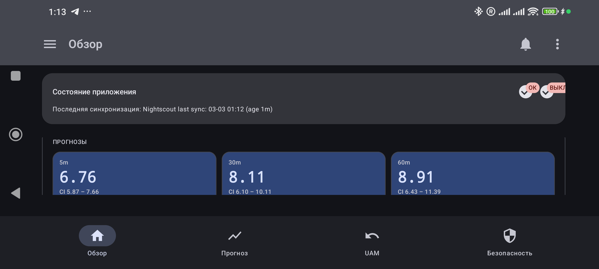
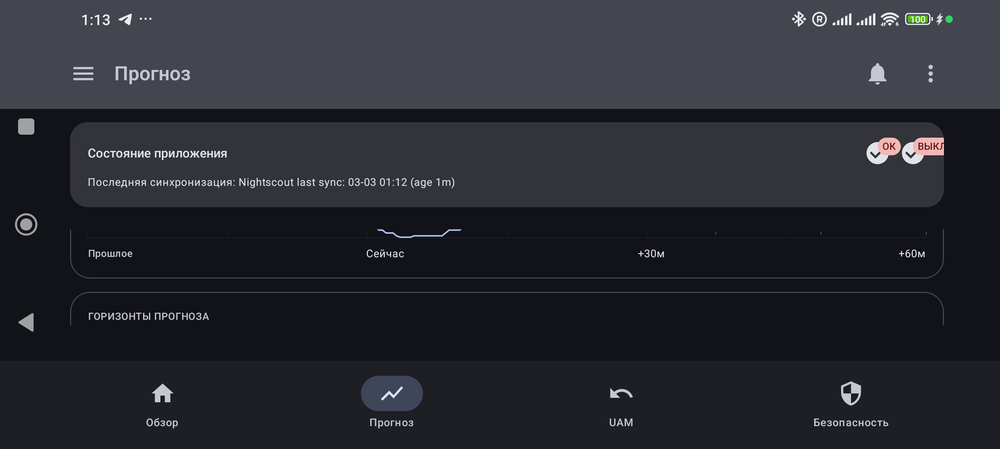
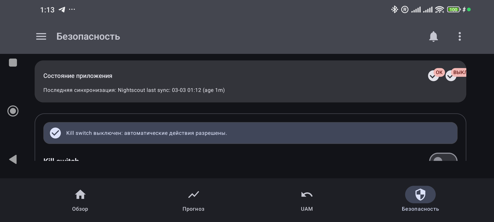

# AAPS Predictive Copilot

A research companion for [AndroidAPS](https://androidaps.readthedocs.io/) (AAPS) and [Nightscout](https://nightscout.github.io/). It explores glucose forecasting, therapy-data analytics, guarded temporary-target management, and safety-focused alerts alongside an existing AAPS setup.

> **Important:** AAPS Predictive Copilot is research software. It is not a clinically validated medical device, does not replace medical guidance or AAPS safety systems, and must not be used with a live therapy setup without careful review by its operator.

## Screens

The following are illustrative static UI captures. They do not represent a person, a treatment session, or a clinical recommendation.

### Overview



### Forecast



### Safety controls



## What the project explores

- Importing and reconciling glucose, insulin, carbohydrate, activity, target, IOB, COB, ISF, and CR context from configured AAPS and Nightscout sources.
- Local forecasts at short and extended horizons, including uncertainty and data-quality context.
- ISF and CR evidence analysis with an explicit user-selected source for Copilot calculations.
- Unannounced-meal (UAM) detection with `Off`, `Observe`, and bounded `Auto` modes.
- One reconciled path for configured temporary-target actions, with delivery status and a global kill switch.
- Episode-based glucose and delivery-trust alerts, including user-controlled `OFF 30m` and `OFF 60m` muting.
- Local 7/30-day compensation summaries and optional AI-assisted reports that remain advisory only.

## Safety boundaries

- AndroidAPS remains responsible for its own therapy logic, confirmations, pump communication, and delivery safeguards.
- Copilot does not autonomously command a bolus or bypass AndroidAPS safety mechanisms.
- Forecasts, inferred carbohydrates, analytics, alerts, and targets are decision-support signals, not medical instructions.
- Automation needs current data, explicit configuration, and observable delivery reconciliation. A kill switch must remain available.
- Never publish Nightscout URLs or tokens, API keys, signing material, exported databases, device logs, or personal therapy data.

## Repository layout

- `android-app/` - Android application written in Kotlin, Compose, Room, and WorkManager.
- `backend/` - optional FastAPI services for analysis and reports.
- `docs/` - design notes, QA material, and implementation documentation.

## Build the Android app

```bash
cd android-app
./gradlew :app:assembleDebug
./gradlew :app:testDebugUnitTest :app:lintDebug
```

Build output and local configuration are intentionally excluded from Git. Configure data sources and any optional AI provider only in the app's local settings; do not add credentials to source files, issue reports, or pull requests.

## Project status

The project is under active research and development. Functional behavior, data-source compatibility, and UI details may change. Before testing an update against a personal setup, verify the build signature, keep a backup, confirm data freshness, and test non-therapeutic paths first.

## Contributing

Issues and pull requests are welcome for reproducible defects, tests, documentation, and privacy or safety improvements. Please redact all health data and secrets before opening an issue.

## License and disclaimer

See the repository license for legal terms. Nothing in this repository is medical advice or a claim of clinical effectiveness.
