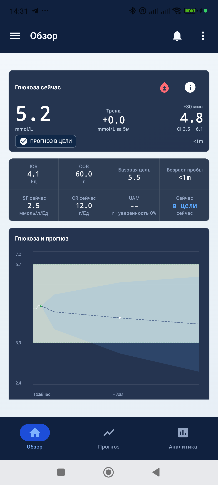
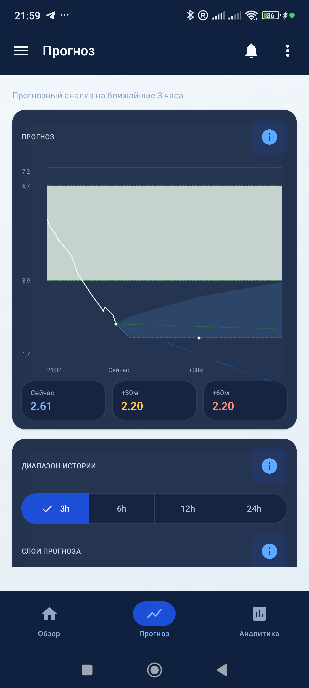
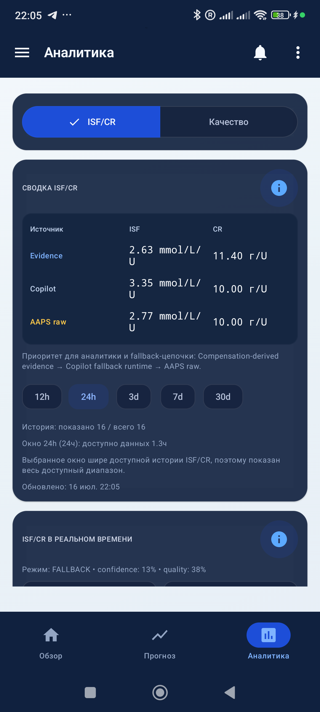

# AAPS Predictive Copilot

> Auditable glucose forecasting and therapy-context intelligence for AndroidAPS and Nightscout.

**AAPS Predictive Copilot** turns the signals already present in an AAPS setup into one explainable operational view: glucose trajectory, forecast uncertainty, insulin and carbohydrate context, changing sensitivity, meal hypotheses, activity, circadian patterns, data quality, and the status of any configured temporary-target action.

It is built for technically experienced people who want to inspect *why* a forecast or automation decision exists, not only see a number.

**Russian summary.** Это исследовательский помощник для AndroidAPS и Nightscout. Он объединяет данные сенсора, инсулина, углеводов, IOB/COB, ISF/CR, активности, качества сенсора и времени суток, чтобы показать прогноз, его неопределённость, контекст и журнал действий в одном приложении.

[Russian version: detailed product description](docs/README_RU.md)

> **Important safety notice:** This is active research software, not a clinically validated medical device. It does not replace clinical advice, AndroidAPS safeguards, or attentive user supervision. Never use an unreviewed build in a live therapy setup.

## Why it is useful

Most glucose views answer one question: "What is the value now?" Copilot is designed to answer the next questions too:

- Where may glucose be in 5, 30, and 60 minutes, and how certain is that estimate?
- Which factors are shaping the forecast: insulin action, COB, inferred carbohydrates, activity, sensor quality, or time-of-day pattern?
- Which ISF and CR value is being used by Copilot, where did it come from, and how reliable is its evidence?
- Does the recent history resemble a repeatable weekday, weekend, or time-of-day pattern?
- Did a configured action reach the outbound channel, or is it only a proposal, blocked decision, or unresolved delivery attempt?

The emphasis is visibility, traceability, and conservative handling of uncertainty rather than opaque "AI control".

## Full feature set

### 1. One operational picture of therapy context

- Combines glucose, bolus and carbohydrate treatments, targets, IOB, COB, insulin duration, sensor age, infusion-set markers, steps, activity, and selected physiology context.
- Imports history from configured Nightscout sources and supports local AAPS/xDrip-compatible glucose and treatment broadcasts.
- Normalizes glucose into a canonical five-minute series before trend, UAM, Kalman, and forecast calculations.
- Shows the freshness and source of incoming data, so an apparently precise value is not confused with a fresh and trustworthy one.
- Retains forecast and analytic history for long-window review instead of exposing only the latest cycle.

### 2. Forecasting that exposes uncertainty

- Produces local forecasts for **5, 30, and 60 minutes** with confidence intervals rather than a single unexplained line.
- Uses a hybrid forecast path that can account for insulin action, profile-derived DIA, IOB, COB, carbohydrate absorption, UAM, activity, sensor quality, sensor lag, ISF/CR context, and circadian priors.
- Keeps the forecast causal: a prediction can use only the data available at its timestamp, which makes later replay meaningful.
- Calibrates bias and uncertainty from past forecast-versus-actual pairs using a bounded, causal lookback.
- Displays forecast quality with MAE, RMSE, MARD, confidence-interval coverage, and factor-attribution diagnostics.
- Supports a bounded optional cloud forecast override, while local policy remains the final safety boundary.

### 3. Explainable ISF and CR analytics

- Keeps three sources visible instead of merging them into one misleading number: **compensation-derived evidence**, **Copilot runtime fallback**, and **raw AAPS telemetry**.
- Lets the operator choose the ISF/CR source used by Copilot calculations without silently rewriting the AAPS profile.
- Fits historical ISF/CR evidence by hour and day type, with outlier handling, sample counts, confidence, fallback reason, and dropped-evidence diagnostics.
- Applies bounded real-time context factors for activity, sensor and infusion-set age, dawn effect, stress, hormone tags, steroid tags, and sensor-quality ambiguity.
- Keeps low-confidence and ambiguous evidence conservative through wider uncertainty and audit-visible reasons.

### 4. Meals, carbohydrate absorption, and UAM

- Tracks announced carbohydrates and event-aware absorption profiles for fast, mixed, and slower protein/fat-heavy meals.
- Estimates residual carbohydrate absorption at multiple horizons for forecast explainability.
- Detects possible unannounced meals through a single UAM event state machine with inferred timing, carbohydrate estimate, and confidence.
- Provides `Off`, `Observe`, and bounded `Auto` UAM modes, so detection can be studied before any configured export path is enabled.
- Uses one idempotent export coordinator for any enabled synthetic-carb delivery and tags synthetic UAM entries so they are not treated as ordinary announced meals when training ISF/CR evidence.
- Records UAM events and reconciliation state for later review rather than making hidden changes.

### 5. Circadian patterns and activity context

- Builds separate 15-minute templates for weekdays, weekends, and all days over selectable historical windows.
- Uses circadian information as a bounded secondary forecast prior, with additional replay-quality checks before it can influence longer horizons.
- Reduces or disables the circadian contribution during acute dynamics, active COB/UAM/IOB states, stale data, or suspect sensor conditions.
- Ingests available steps, activity ratio, distance, active minutes, and active calories from local/device sources.
- Applies an activity-protection target strategy only through the configured rules and remains observable in analytics and audit history.

### 6. Guarded temporary-target automation

- Evaluates configured target rules from a unified runtime snapshot instead of independent UI calculations.
- Uses deterministic policy checks, hard target bounds, idempotency keys, duplicate throttling, and action receipts.
- Sends configured temporary-target events through the primary Nightscout path, with an optional compatible local fallback path.
- Shows the latest proposal, accepted action, blocked decision, or delivery result in the operator-facing UI and audit trail.
- Keeps a global kill switch for immediately stopping automated actions.

### 7. Safety status, audit, and quality diagnostics

- Surfaces glucose-risk, stale-data, sensor-quality, policy, and automation-state warnings in the operator UI.
- Makes policy blocks, fallback selection, forecast-factor coverage, data quality, and action idempotency inspectable in the audit surface.
- Provides daily local forecast-quality reports and replay views that highlight the conditions where the model performs well or poorly.
- Exports supported analytics and report views for offline review where configured.

### 8. Advisory AI analysis

- Offers optional AI-assisted analysis and chat when an operator configures a provider.
- Prepares structured, bounded context for report and forecast-calibration analysis.
- Restricts AI output to analysis and bounded calibration parameters. AI output cannot issue therapy commands, deliver a bolus, or bypass local policy.
- Degrades to local analysis when the provider is unavailable or a response fails validation.

## Product workflow

1. Connect the data sources already used in your setup and review their freshness.
2. Inspect the current glucose, trend, IOB/COB, target, and 5/30/60-minute forecast.
3. Open Forecast or Analytics to see uncertainty, ISF/CR provenance, UAM context, activity, and circadian evidence.
4. Review the policy and audit result before trusting any configured temporary-target automation.
5. Use daily reports and replay metrics to improve the data model and configuration, not to replace clinical judgement.

## Screens

The screens below contain historical glucose and therapy data. The project owner explicitly authorized their public publication. They are examples of the product interface, not medical advice, a treatment recommendation, or evidence of clinical effectiveness.

### Overview



### Forecast



### ISF/CR analytics



## Architecture

The project has two deliberately separated parts:

- `android-app/`: Kotlin/Compose application for ingestion, local storage, forecasting, rules, safety policy, automation, and user interface.
- `backend/`: optional FastAPI service for cloud prediction augmentation, replay, scheduling, and advisory analysis.

Android remains the source of truth for the local runtime loop. Cloud and LLM features are optional augmentation layers and cannot bypass local safety policy. See [architecture details](docs/ARCHITECTURE.md) and [runtime invariants](docs/INVARIANTS.md).

## Safety and scope

- AndroidAPS retains control of its own therapy logic, confirmations, pump communication, and delivery safeguards.
- Copilot never autonomously commands a bolus and must not bypass AndroidAPS safeguards.
- Forecasts, inferred carbohydrates, alerts, analytics, and targets are decision-support signals, not medical instructions.
- Any configured target action must pass local policy, delivery reconciliation, and the active kill-switch state.
- Data freshness, sensor-quality ambiguity, and uncertainty are treated as first-class inputs rather than ignored edge cases.
- This repository is not affiliated with or endorsed by the AndroidAPS, OpenAPS, or Nightscout projects.

## Privacy and responsible publication

- Do not commit Nightscout URLs or tokens, API keys, signing material, exported databases, device logs, or another person's therapy data.
- Keep local connection settings and optional AI-provider credentials out of source control.
- The screenshots in this README use the project owner's historical data with explicit publication permission. Do not reuse that exception for other data.
- Review the payload and provider settings before enabling any optional cloud or AI feature.

## Build the Android app

```bash
cd android-app
./gradlew :app:assembleDebug
./gradlew :app:testDebugUnitTest :app:lintDebug
```

For the optional backend:

```bash
cd backend
python3.12 -m venv .venv
source .venv/bin/activate
pip install -r requirements.txt
uvicorn app.main:app --reload --port 8080
```

Build output, local settings, and credentials are intentionally excluded from Git.

## Project status and contribution

The project is under active research and development. Interfaces, integrations, and algorithms may change as they are tested against replay and quality metrics. Contributions are welcome for reproducible defects, test coverage, documentation, privacy, safety, and data-quality improvements. Please redact all health data and credentials before opening an issue or pull request.

## Legal and medical notice

Nothing in this repository is medical advice, a guarantee of glucose outcomes, or a claim of clinical effectiveness. Verify every configuration and release independently before use.
